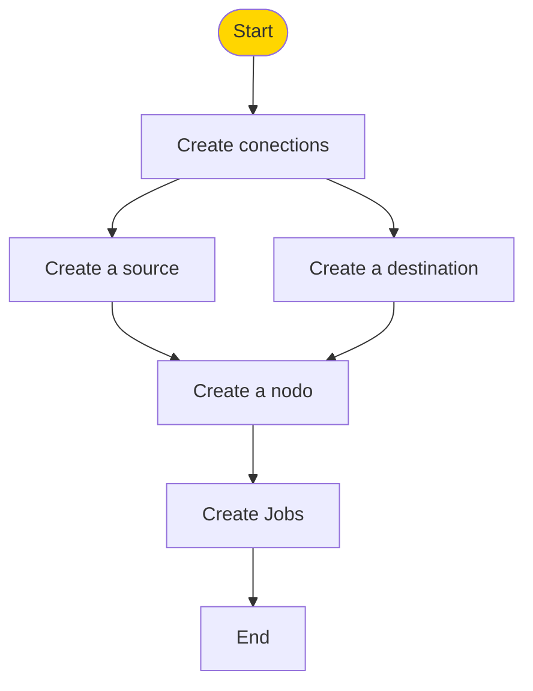

# Let's start

# Let's have a quick look at creating your first job in 
Create your first automations to synchronize your source data in SAP with your destination in AWS.

## Create Connections

To get started, make sure you have the necessary credentials for both the source and destination. Follow the steps below to set up your connections:

If you require more information on connections, please see the [connections page](/docs/sections/conections/).
### Create new Source 
**Source Connection**: Provide your source credentials and configure the connection parameters.

### Create New Destination
Enter the required data to be able to connect correctly with your destination.

## Create Nodes
For node creation, it is essential to have previously established at least one [Souce](/docs/start#create-new-source) and one [Destination](/docs/start#Create-New-Destination).These connections are fundamental, as the nodes will depend on them to effectively synchronize the data. Make sure to properly configure both ends before proceeding with node creation.

## Create a new JOB
To generate a Job it is required that at least one [node](#Node-Creation) has been generated.

1. Click on the "Create Job" button.

2. Change the name of the Job.

3. Click on "Nodes".

4. Select the control node and drag it to the right, along with the extraction nodes you need.

5. Link the nodes together.

6. Click the green button to save the changes.

7. Executes the job or schedules its execution.

